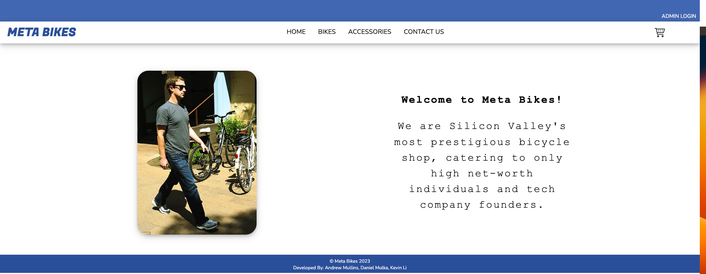

# META BIKES

---

Zuckerberg's very own e-commerce site specializing in high end bicycles and accessories.

## Project 
MetaBikes is a multi-page, full-stack, CRUD capable e-commerce site. 

## Functionality 

Navigate through the site's inventory of bikes and accessories.  

Click on any item you are interested in to get more info. 

Add and remove items from the cart.

Leave a comment. 

## Team 
- Kevin Li
- Andrew Mullins
- Daniel Mulka

## Modules 

<bike>
    <summery>Bike</summery>

    ### Bike
    The Bike model stores all fields of data that might be relavent to a potential shopper. It is the parent to our cartitem object and contains the fields: 
    type: String
    brand: String
    model: String
    price: Number
    color: String
    weight: Number
    description: String
    img: String
    category: String 

</bike>

<accessories>
    <summery>###accessory</summery>

     ## accessory 
     Accessories like bikes, stores all the data a shopper will need to know and is also a parent to cartitem. Accessories fields are:
    type: String 
    brand: String
    item: String
    price: Number
    img: String
    description: String 
    category: String 
     

    <summery>cartitem</summery>

     ## cartitem

    <summery>comment</summery>

     ## comment

